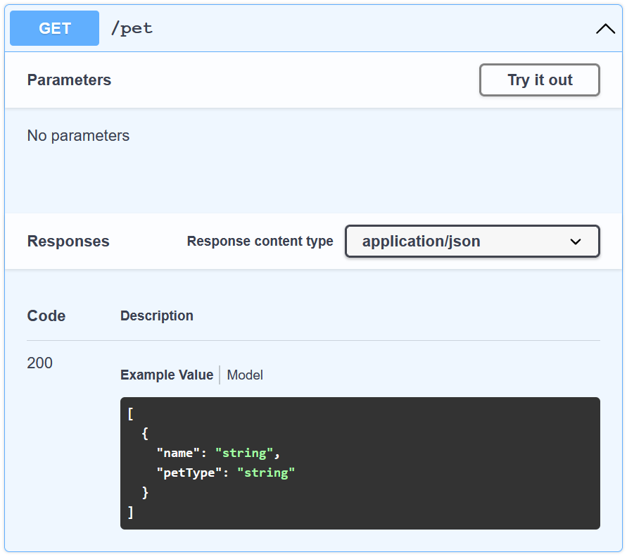
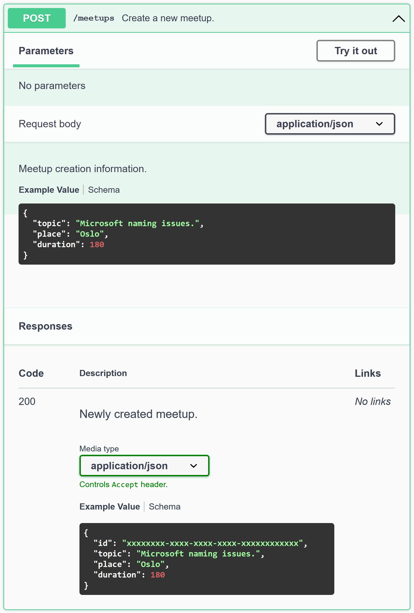
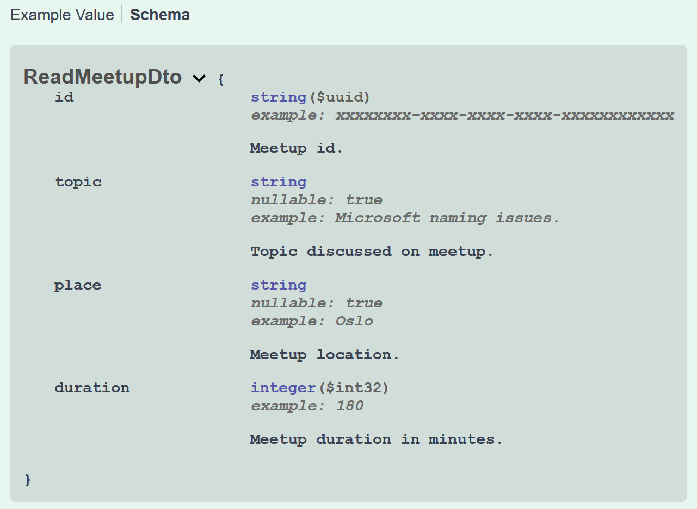

# OpenAPI документация

Ранее (во время создания проекта) мы уже поверхностно косались темы документирования Web API с использованием Open API
спецификации. Сейчас мы рассмотрим этот вопрос более подробно.


## Содержание

1. [Что такое OAS и Swagger](#Что-такое-OAS-и-Swagger)
2. [Как работать с OAS в ASP](#Как-работать-с-OAS-в-ASP)
3. [Документирование контроллера митапов](#Документирование-контроллера-митапов)


## Что такое OAS и Swagger

Подробно ознакомиться с тем, что из себя представляет OAS (**O**pen **A**PI **S**pecification) можно на
[официальном сайте](https://swagger.io/resources/open-api/). Сейчас важно понимать, что OAS - документационное описание
Web API (больше всего подходящее для Rest API), предназначенное для дальнейшей обработки программными инструментами.

Пример OAS:
```json
{
  "/pets": {
    "get": {
        "responses": {
        "200": {
          "content": {
            "application/json": {
              "schema": {
                "type": "array",
                "items": {
                  "type": "object",
                  "properties": {
                    "name": {
                      "type": "string"
                    },
                    "petType": {
                      "type": "string"
                    }
                  },
                  "required": [
                    "name",
                    "petType"
                  ]
                }
              }
            }
          }
        }
      }
    }
  }
}
```
Если приложить некоторые усилия, то можно разобраться, что описывается endpoint `GET /pets`, который возвращает только
`200 Ok` status code вместе с `HTTP Body`, представляющим из себя массив объектов с 2мя обязательными строкоыми
параметрами: `name` и `petType`.

OAS имеет огромное количество областей применений и может быть полезен во многих ситуациях. Например, можно написать OAS
и, уже на её основе, сгенерировать клиентский и серверный код (в нашем случае Web UI и Web API). Однако, возникает
проблема использования OAS - человеку сложно его читать (выше приведённый пример – относительно простой, и был приведён
просто что бы у читателя возникло общее представление о структуре OAS). Эту проблему и решает Swagger.

Swagger – UI для OAS, представляющий его в удобной форме. Тот же OAS, но в Swagger:




## Как работать с OAS в ASP

В NuGet есть огромное количество библиотек для генерации OAS из source code. Самые популярные:
1. [Swashbuckle](https://www.nuget.org/packages/Swashbuckle.AspNetCore)
2. [NSwag](https://www.nuget.org/packages/NSwag.AspNetCore)
3. [Swagger-Net](https://www.nuget.org/packages/Swagger-Net).

Для простоты мы будем использовать Swashbucle, т.к. Microsoft уже настроил его за нас (он уже включён в шаблон, который
мы использовали при создании проекта).

Большую часть информации Swashbuckle собирает из анотаций проде `[HttpGet]` или `[ProducesResponseType(200)]`, однако
описания endpoint'ов и моделей данных он собирает из документационных комментариев. Для того, что бы у Swashbuckle был
доступ к этой информации нужно:
1. [Сгенерировать `.xml`-файл с комментариями](#Как-сгенерировать-xml-файл)
2. [Настроить Swagger на использование этого файла](#Как-подключить-xml-файл).
Эти шаги также расписаны в [статье от Microsoft](https://docs.microsoft.com/en-us/aspnet/core/tutorials/getting-started-with-swashbuckle#xml-comments).

### Как сгенерировать xml файл

В файл `Meets.WebApi.csproj` нужно добавить следующий блок:
```xml
<PropertyGroup>
    <GenerateDocumentationFile>true</GenerateDocumentationFile>
    <NoWarn>$(NoWarn);1591</NoWarn>
</PropertyGroup>
```
`GenerateDocumentationFile`: включает генерацию xml-файла. `NoWarn 1591`: отключает предупреждения о том, что не весь
код документирован.

### Как подключить xml файл

В модуле `Program`, строку с вызовом `.AddSwaggerGen()` нужно заменить на:
```csharp
builder.Services.AddSwaggerGen(options =>
{
    var projectDirectory = AppContext.BaseDirectory;
    
    var projectName = Assembly.GetExecutingAssembly().GetName().Name;
    var xmlFileName = $"{projectName}.xml";
    
    options.IncludeXmlComments(Path.Combine(projectDirectory, xmlFileName));
});
```


## Документирование контроллера митапов

Теперь приступим к документированию контроллера `MeetupController`:
1. [Предоставим описание полей (и примеры их значений) для DTO](#Документирование-DTO)
2. [Укажем тип принимаемых и генерируемых контроллером данных](#Документирование-контроллера)
3. [Опишем входные и выходные данные для каждого action'а](#Документирование-actionов)
4. [Резульат](#Результат)

### Документирование DTO

Для DTO можно указать описание и примеры значений полей. Пример с `ReadMeetupDto`:
```csharp
public class ReadMeetupDto
{
    /// <summary>Meetup id.</summary>
    /// <example>xxxxxxxx-xxxx-xxxx-xxxx-xxxxxxxxxxxx</example>
    public Guid Id { get; set; }
    
    /// <summary>Topic discussed on meetup.</summary>
    /// <example>Microsoft naming issues.</example>
    public string Topic { get; set; }
    
    /// <summary>Meetup location.</summary>
    /// <example>Oslo</example>
    public string Place { get; set; }
    
    /// <summary>Meetup duration in minutes.</summary>
    /// <example>180</example>
    public int Duration { get; set; }
}
```
Остальные DTO документируются по аналогии.

### Документирование контроллера

Для контроллера мы можем указать, что он работает с данными в формате `json`, добавив анотации `[Consumes]` и
`[Produces]`:
```csharp
[ApiController]
[Route("/meetups")]
[Consumes(MediaTypeNames.Application.Json)]
[Produces(MediaTypeNames.Application.Json)]
public class MeetupController : ControllerBase
```

### Документирование action'ов

Для action'ов мы можем указать:
1. Общее описание выполняемого действия – `<summary>...</summary>`
2. Описание и примеры значений для принимаемых параметров – `<param name="id" example="745">...</param>`
3. Значения возвращаемых HTTP статус-кодов – `<response code="200">...</response>`
4. Возвращаемые HTTP статус-коды (при желании с типом данных) - `[ProducesResponseType(typeof(ProductDto), 200)]`
```csharp
/// <summary>Delete meetup with matching id.</summary>
/// <param name="id" example="xxxxxxxx-xxxx-xxxx-xxxx-xxxxxxxxxxxx">Meetup id.</param>
/// <response code="200">Deleted meetup.</response>
/// <response code="404">Meetup with specified id was not found.</response>
[HttpDelete("{id:guid}")]
[ProducesResponseType(typeof(ReadMeetupDto), StatusCodes.Status200OK)]
[ProducesResponseType(StatusCodes.Status404NotFound)]
public IActionResult DeleteMeetup([FromRoute] Guid id)
{
    var meetupToDelete = Meetups.SingleOrDefault(meetup => meetup.Id == id);
    if (meetupToDelete is null)
    {
        return NotFound();
    }
    Meetups.Remove(meetupToDelete);

    var readDto = new ReadMeetupDto
    {
        Id = meetupToDelete.Id,
        Topic = meetupToDelete.Topic,
        Place = meetupToDelete.Place,
        Duration = meetupToDelete.Duration
    };
    return Ok(readDto);
}
```

Остальные action'ы можете продокументировать по аналогии.

### Результат

Теперь у контроллеров митапов есть общее описание:


Также, у каждого action'а есть подробное описание:



И каждый DTO подробно описан:

