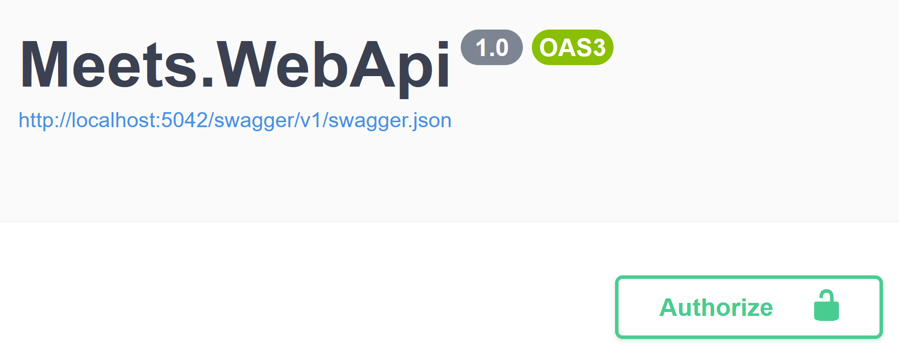
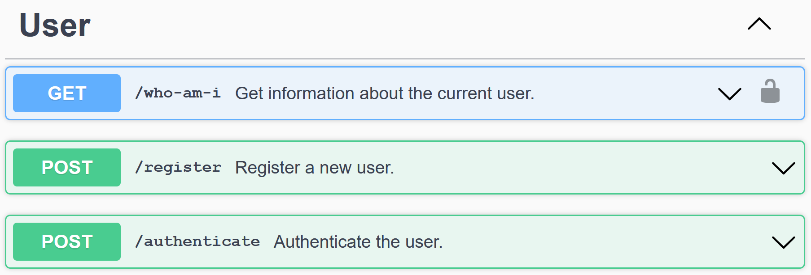
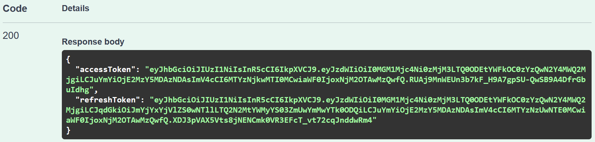
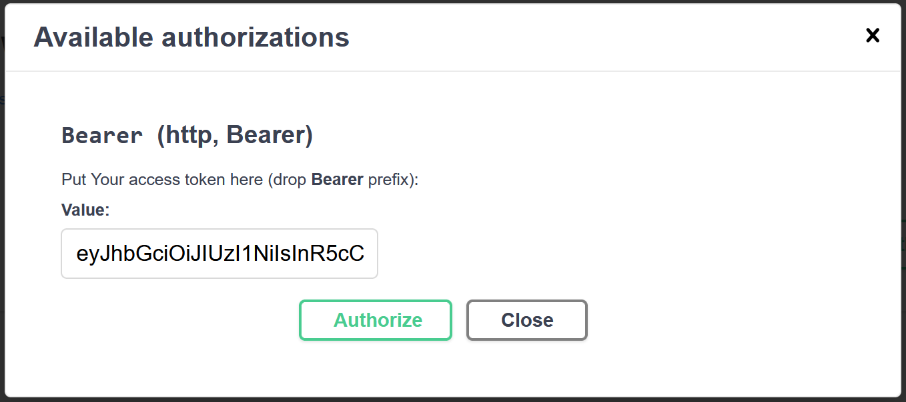
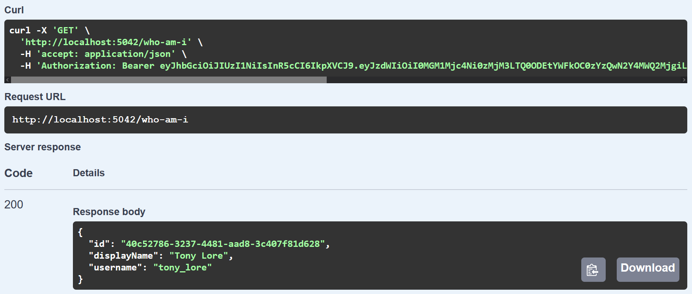

# Расширение API - JWT Auth

В этом уроке мы расширим наш Web API, добавив JWT Auth. Понятия и особенности JWT Auth достаточно хорошо освещены Ильёй
Климовым в 2х первых видео из
[плейлиста про JWT](https://www.youtube.com/watch?v=vQldMjSJ6-w&list=PLvTBThJr861y60LQrUGpJNPu3Nt2EeQsP). Мы реализуем
схему с 2мя токенами: `Access Token` и `Refresh Token` (`AT` и `RT`). `Refresh Token`'ы будем хранить в БД.


## Содержание

1. [Выпуск Token Pair](#Выпуск-Token-Pair)
2. [Использование Access Token](#Использование-Access-Token)
3. [Рефреш Token Pair](#Рефреш-Token-Pair)
4. [Валидация и документация](#Валидация-и-документация)


## Выпуск Token Pair

Начнём с того, что аутентифицируем пользователя и выдадим ему `Token Pair`: пользователь будет отправлять нам `Username`
и `Password`, а мы будем проверять их на корректность, и, в случае успеха, выписывать пользователю `AT` и `RT`.

### Refresh Token Entity

Во-первых нам нужно создать Entity для RT (мы ведь собираемся хранить RT в БД). У каждого RT должен быть уникальный
идентификатор, что бы мы могли их различать. Также, мы должны хранить информацию о том, кто является владельцем этого
токена (будем хранить id пользователя, для которого был выписан токен). Время от времени мы можем захотеть удалять
неиспользованные протухшие токены, так что нам нужно хранить информацию о том, когда токен протухает и его можно
удалять. В итоге имеем:
```csharp
public class RefreshTokenEntity
{
    public Guid Id { get; set; }
    public Guid UserId { get; set; }
    public DateTime ExpirationTime { get; set; }
}
```

Укажите кастомные имена для полей и самой таблицы; добавьте `DbSet` в `DatabaseContext`; создайте и примените миграцию.

### Конфигурация JWT Auth

При генераци `Token Pair` мы будем использовать 3 настраиваемых параметра:
1. Ключ, который будем использовать для того, что бы подписывать токены (для подписи будем использовать `sha-256`, так
что ключ должен быть не короче `32 символов`)
2. Время жизни `Access Token`'а: пусть будет `15 минут`
3. Время жизни `Refresh Token`'а: пусть будет `7 дней`.

Хранить эти настройки будем в секции `JwtAuth` в файле `appsettings.Development.json`:
```json
"JwtAuth": {
  "Secret": "32-chars long key to sign tokens",
  "AccessTokenLifetime": "15",
  "RefreshTokenLifetime": "7"
}
```

### Authenticate endpoint

Для аутентификации пользователя нам нужно использовать `POST` метод (т.к. мы хотим передать `Username` и `Password` в
`HTTP Body`), однако, в `UserController` уже есть action с методом `POST` - регистрация пользователя. Нам нужно изменить
endpoint регистрации пользователя с `POST /users` на `POST /users/register`, после чего мы сможем добавить action на
аутентификацию пользователя (endpoint `POST /users/authenticate`).

Как уже было сказано ранее, принимать этот action будет `Username` и `Password`, а возвращать будет `Access Token` и
`Refresh Token`:
```csharp
public class AuthenticateUserDto
{
    public string Username { get; set; }
    public string Password { get; set; }
}

public class TokenPairDto
{
    public string AccessToken { get; set; }
    public string RefreshToken { get; set; }
}
```

### Проверка `Username` и `Password`

Перед тем, как сгенерируем `Token Pair` для пользователя, сначала проверим, зарегистрирован ли такой пользователь и был
ли предоставлен корректный пароль:
```csharp
var user = await _context.Users.FirstOrDefaultAsync(user => user.Username == authenticateDto.Username);
if (user is null)
{
    return NotFound();
}
if (!BCrypt.Verify(authenticateDto.Password, user.Password))
{
    return Conflict("Incorrect password.");
}
```

### Подготовка к выпуску токенов

Для работы с JWT, установим библиотеку [Microsoft.AspNetCore.Authentication.JwtBearer](https://www.nuget.org/packages/Microsoft.AspNetCore.Authentication.JwtBearer).
Перед выпуском токенов, подготовим все необходимые конфигурационные параметры и создадим `Token Handler`:
```csharp
var tokenHandler = new JwtSecurityTokenHandler();
var jwtSecret = Encoding.ASCII.GetBytes(_configuration["JwtAuth:Secret"]);
var accessTokenLifetime = int.Parse(_configuration["JwtAuth:AccessTokenLifetime"]);
var refreshTokenLifetime = int.Parse(_configuration["JwtAuth:RefreshTokenLifetime"]);
```
Поле `_configuration` получается с помощью inject'а типа `IConfiguration` в `UserController`:
```csharp
private readonly DatabaseContext _context;
private readonly IConfiguration _configuration;

public UserController(DatabaseContext context, IConfiguration configuration)
{
    _context = context;
    _configuration = configuration;
}
```

### Выпуск токенов

Выпустим `Access Token`:
```csharp
var accessTokenDescriptor = new SecurityTokenDescriptor
{
    Subject = new ClaimsIdentity(new[] {new Claim("sub", user.Id.ToString())}),
    Expires = DateTime.UtcNow.AddMinutes(accessTokenLifetime),
    SigningCredentials = new SigningCredentials(new SymmetricSecurityKey(jwtSecret),
        SecurityAlgorithms.HmacSha256Signature)
};
var accessToken = tokenHandler.CreateToken(accessTokenDescriptor);
var encodedAccessToken = tokenHandler.WriteToken(accessToken);
```
Свойство `Subject` и JWT Claim `sub` представляют идентификатор владельца токена (в нашем случае id пользователя).
Свойство `Expires` указывает в какой момент токен протухнет. Свойство `SigningCredentials` используется для генерации
подписи.

Далее нам нужно подготовить информацию о `Refresh Token` и сохранить его в БД:
```csharp
var refreshTokenEntity = new RefreshTokenEntity
{
    Id = Guid.NewGuid(),
    UserId = user.Id,
    ExpirationTime = DateTime.UtcNow.AddDays(refreshTokenLifetime)
};
_context.RefreshTokens.Add(refreshTokenEntity);
await _context.SaveChangesAsync();
```

После чего мы можем выпустить `Refresh Token`:
```csharp
var refreshTokenDescriptor = new SecurityTokenDescriptor
{
    Subject = new ClaimsIdentity(new[]
    {
        new Claim("sub", user.Id.ToString()),
        new Claim("jti", refreshTokenEntity.Id.ToString())
    }),
    Expires = refreshTokenEntity.ExpirationTime,
    SigningCredentials = new SigningCredentials(new SymmetricSecurityKey(jwtSecret),
        SecurityAlgorithms.HmacSha256Signature)
};
var refreshToken = tokenHandler.CreateToken(refreshTokenDescriptor);
var encodedRefreshToken = tokenHandler.WriteToken(refreshToken);
```
JWT Claim `jti` представляет уникальный идентификатор самого токена.

Теперь нам осталось лишь вернуть `Token Pair` пользователю:
```csharp
var tokenPairDto = new TokenPairDto
{
    AccessToken = encodedAccessToken,
    RefreshToken = encodedRefreshToken
};
return Ok(tokenPairDto);
```


## Использование Access Token

У пользователя есть возможность аутентифицироваться и получить `Access Token`. Теперь нам нужно добавить какой-нибудь
action, который будет требовать аутентифицрованного пользователя – например, получение информации о владельце `AT`.

### Атрибут Authorize

В ASP уже есть встроенный механизм авторизации: для того, что бы action принимал только запросы от аутентифицированных
пользователей нужно пометить его атрибутом `[Authorize]`.

Создадим action, который будет требовать `Access Token` и по запросу `GET /users/who-am-i` будет возвращать информацию о
его владельце:
```csharp
[HttpGet("/who-am-i")]
[Authorize]
public async Task<IActionResult> GetCurrentUserInfo()
{
    var subClaim = User.Claims.Single(claim => claim.Type == "sub");
    var currentUserId = Guid.Parse(subClaim.Value);

    var currentUser = await _context.Users.SingleAsync(user => user.Id == currentUserId);

    var readDto = new ReadUserDto
    {
        Id = currentUser.Id,
        DisplayName = currentUser.DisplayName,
        Username = currentUser.Username
    };
    return Ok(readDto);
}
```
Из необычного тут только обращение к `User.Claims` и получение JWT Claim'а с типом `NameIdentifier`. `User` – свойство
класса `ControllerBase` (от которого мы унаследовали `UserController`), предоставляющее доступ ко всей информации о
пользователе, а `IEnumerable<Claim> Claims` – набор всех JWT Claim'ов, которые были в `payload` секции `AT`.

### Настройка JWT Auth в ASP

Что бы атрибут `[Authorize]` начал работать, нам нужно сначала настроить ASP на работу с JWT. Для этого нам нужно
добавить сервися авторизации в модуле `Program`:
```csharp
builder.Services
    .AddAuthentication(JwtBearerDefaults.AuthenticationScheme)
    .AddJwtBearer(options =>
    {
        var jwtSecret = Encoding.ASCII.GetBytes(configuration["JwtAuth:Secret"]);
        options.TokenValidationParameters = new TokenValidationParameters
        {
            RequireSignedTokens = true,
            ValidateIssuerSigningKey = true,
            IssuerSigningKey = new SymmetricSecurityKey(jwtSecret),

            ValidateAudience = false,
            ValidateIssuer = false,

            RequireExpirationTime = true,
            ValidateLifetime = true,
            ClockSkew = TimeSpan.Zero
        };
        options.RequireHttpsMetadata = false;

        var tokenHandler = options.SecurityTokenValidators.OfType<JwtSecurityTokenHandler>().Single();
        tokenHandler.InboundClaimTypeMap.Clear();
        tokenHandler.OutboundClaimTypeMap.Clear();
    });
```

Также нужно сообщить ASP, что нужно использовать добавленные сервисы авторизации, прописав:
```csharp
app.UseAuthentication();
app.UseAuthorization();
```

> **Note**: Эти 2 вызова **обязательно** должны быть именно в таком порядке. Также они должны идти после
`app.UseRouting()`, но до `app.MapControllers()`.

### Настройка Swagger

Мы настроили аутентификацию в ASP и сейчас наш Web API может принимать авторизованные запросы. Однако, мы не можем их
послать с помощью Swagger, т.к. его мы ещё не настроили.

В модуле `Program` в вызов `.AddSwaggerGen` нужно добавить код, сообщающий генератору OAS о том, что мы используем JWT
Auth:
```csharp
options.AddSecurityDefinition("Bearer", new OpenApiSecurityScheme
{
    Description = "Put Your access token here (drop **Bearer** prefix):",
    Type = SecuritySchemeType.Http,
    Scheme = "bearer",
    BearerFormat = "JWT"
});
```

Также, нам нужно написать фильтр, который будет проходить по всем action'ам и узнавать, используют ли они `[Authorize]`
атрибут. Создадим папку `Filters` в корне проекта и объявим в ней класс `OpenApiAuthFilter`:
```csharp
internal class OpenApiAuthFilter : IOperationFilter
{
    private readonly OpenApiSecurityRequirement _authenticationRequirement;

    public OpenApiAuthFilter() =>
        _authenticationRequirement = new OpenApiSecurityRequirement
        {
            {
                new OpenApiSecurityScheme
                {
                    Reference = new OpenApiReference
                    {
                        Id = "Bearer",
                        Type = ReferenceType.SecurityScheme
                    }
                },
                Array.Empty<string>()
            }
        };

    public void Apply(OpenApiOperation operation, OperationFilterContext context)
    {
        var actionMetadata = context.ApiDescription.ActionDescriptor.EndpointMetadata;
        var markedWithAuthorize = actionMetadata.Any(metadataItem => metadataItem is AuthorizeAttribute);
        
        if (markedWithAuthorize)
        {
            operation.Security.Add(_authenticationRequirement);
        }
    }
}
```

Этот фильтр нужно зарегистрировать, вызвав `options.OperationFilter<OpenApiAuthFilter>()` внутри `.AddSwaggerGen`.

### Результат

Если мы запустим приложение, то увидим, что на странице swagger появилась кнопка `Authorize`:



Также endpoint `GET /users/who-am-i` помечен иконкой замка:



Для начала авторизуемся:



Скопируем значение поля `accessToken`, нажмём на кнопку `Authorize` и вставим значение в input.



Кнопка `Authorize` – использовать токен.

Выполним запрос на получение информации о пользователе:




## Рефреш Token Pair

Пользователь может авторизоваться и посылать авторизированные запросы. Осталась только одна проблема – авторизовываться
нужно каждые 15 минут, т.к. протухает `AT`. Решим эту проблему и добавим action для рефреша `Token Pair`'а:
```csharp
[HttpPost("/refresh")]
public async Task<IActionResult> RefreshTokenPair([FromBody] string refreshToken)
{
    var jwtSecret = Encoding.ASCII.GetBytes(_configuration["JwtAuth:Secret"]);
    var tokenValidationParameters = new TokenValidationParameters
    {
        RequireSignedTokens = true,
        ValidateIssuerSigningKey = true,
        IssuerSigningKey = new SymmetricSecurityKey(jwtSecret),

        ValidateAudience = false,
        ValidateIssuer = false,

        RequireExpirationTime = true,
        ValidateLifetime = true,
        ClockSkew = TimeSpan.Zero
    };
    
    var tokenHandler = new JwtSecurityTokenHandler();
    tokenHandler.InboundClaimTypeMap.Clear();
    tokenHandler.OutboundClaimTypeMap.Clear();

    try
    {
        var principal = tokenHandler.ValidateToken(refreshToken, tokenValidationParameters, out _);

        // Check if token has already been used 
        var jtiClaim = principal.Claims.Single(claim => claim.Type == "jti");
        var refreshTokenId = Guid.Parse(jtiClaim.Value);
        var refreshTokenEntity = await _context.RefreshTokens.SingleOrDefaultAsync(rt => rt.Id == refreshTokenId);
        if (refreshTokenEntity is null)
        {
            // The token is either fake or has already been used
            return Conflict("Provided refresh token has already been used.");
        }

        // Remove a token from the database so that it can no longer be used
        _context.RefreshTokens.Remove(refreshTokenEntity);
        await _context.SaveChangesAsync();

        // Prepare token info
        var userId = principal.Claims.Single(claim => claim.Type == "sub").Value;
        var accessTokenLifetime = int.Parse(_configuration["JwtAuth:AccessTokenLifetime"]);
        var refreshTokenLifetime = int.Parse(_configuration["JwtAuth:RefreshTokenLifetime"]);

        // Issue new access token
        var accessTokenDescriptor = new SecurityTokenDescriptor
        {
            Subject = new ClaimsIdentity(new[] {new Claim("sub", userId)}),
            Expires = DateTime.UtcNow.AddMinutes(accessTokenLifetime),
            SigningCredentials = new SigningCredentials(new SymmetricSecurityKey(jwtSecret),
                SecurityAlgorithms.HmacSha256Signature)
        };
        var newAccessToken = tokenHandler.CreateToken(accessTokenDescriptor);
        var encodedNewAccessToken = tokenHandler.WriteToken(newAccessToken);

        // Save refresh token info
        var newRefreshTokenEntity = new RefreshTokenEntity
        {
            Id = Guid.NewGuid(),
            UserId = Guid.Parse(userId),
            ExpirationTime = DateTime.UtcNow.AddDays(refreshTokenLifetime)
        };
        _context.RefreshTokens.Add(newRefreshTokenEntity);
        await _context.SaveChangesAsync();

        // Issue new refresh token
        var refreshTokenDescriptor = new SecurityTokenDescriptor
        {
            Subject = new ClaimsIdentity(new[]
            {
                new Claim("sub", userId),
                new Claim("jti", refreshTokenEntity.Id.ToString())
            }),
            Expires = refreshTokenEntity.ExpirationTime,
            SigningCredentials = new SigningCredentials(new SymmetricSecurityKey(jwtSecret),
                SecurityAlgorithms.HmacSha256Signature)
        };
        var newRefreshToken = tokenHandler.CreateToken(refreshTokenDescriptor);
        var encodedNewRefreshToken = tokenHandler.WriteToken(newRefreshToken);

        // Return new token pair back to user
        var tokenPairDto = new TokenPairDto
        {
            AccessToken = encodedNewAccessToken,
            RefreshToken = encodedNewRefreshToken
        };
        return Ok(tokenPairDto);
    }
    catch (Exception)
    {
        return BadRequest("Invalid refresh token was provided.");
    }
}
```


## Валидация и документация

Осталось лишь добавить валидацию DTO и документировать action'ы с DTO. Обратите внимание, что не нужно валидировать
длину и содержимое полей `Username` и `Password` при авторизации пользователя, т.к. они либо совпадут, что говорит о
том, что они валидны (т.к. они прошли валидацию при регистрации), либо нет – тогда нас не волнует, валидны ли они:
```csharp
public class AuthenticateUserDto
{
    [Required]
    public string Username { get; set; }
    
    [Required]
    public string Password { get; set; }
}
```

К тому же, мы со временем можем изменить правила валидации `Username` и `Password`. Если бы мы валидировали их при
авторизации, то пользователи, зарегистрировавшиеся до изменения правил, не смогли бы авторизоваться.