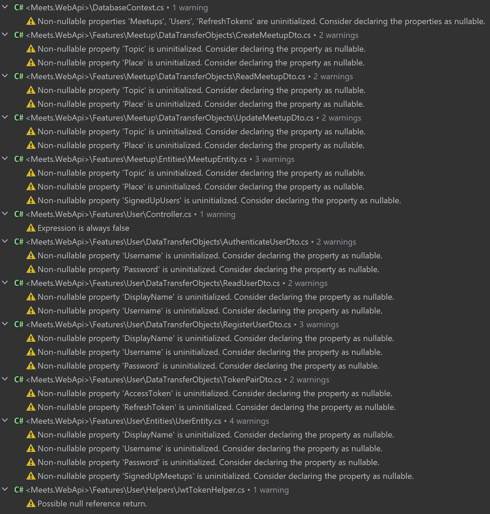

# Рефакторинг: Features и Nullable reference types

В этом уроке мы перераспределим код в проекте и решим проблему с Nullable reference types.

## Содержание

1. [Features](#Features)
2. [Nullable reference types](#Nullable-reference-types)


## Features

Начнём с того, что разделим код на 2 части: архитектурная и функциональная. К функциональной части будет относиться всё,
что напрямую связано с каким-либо функционалом приложения – в нашем случае это содержимое папок `Meetup` и `User`. К
архитектурной части будет относиться всё то, что либо не влияет напрямую на выполнение основных функций приложения
(например параметры запуска), либо просто не может быть разделено (например `DatabaseContext`).

Функциональную часть вынесем в папку `Features`. Также у каждой фичи заменим файлы `DataTransferObjects` и `Model`
папками с несколькими файлами, содержащими отдельные классы. В случае `Model`, папку переименуем в `Entities`; по
желанию можно настроить [File Nesting](https://www.jetbrains.com/help/rider/File_Nesting_Dialog.html), что бы
`...EntityTypeConfiguration` был вложен в `...Entity`. Также можно обратить внимание на то, что `JwtTokenHelper`
используется только `User` feature, а, значит, его можно перенести в папку `Features/User/Helpers` (`TokenPair` также
вынести в отдельный файл).

В результате имеем следующую структуру:
```
│
├── Properties
│   └── launchSettings.json
├── Extensions
│   ├── ApplicationBuilderExtensions.cs
│   ├── ConfigurationExtensions.cs
│   └── DependencyInjectionExtensions.cs
├── Features
│   ├── Meetup
│   │   ├── DataTransferObjects
│   │   │   ├── CreateMeetupDto.cs
│   │   │   ├── ReadMeetupDto.cs
│   │   │   └── UpdateMeetupDto.cs
│   │   ├── Entities
│   │   │   ├── MeetupEntity.cs
│   │   │   └── MeetypEntityTypeConfiguration.cs
│   │   ├── Controller.cs
│   │   └── MappingProfile.cs
│   ├── User
│   │   ├── DataTransferObjects
│   │   │   ├── AuthenticateUserDto.cs
│   │   │   ├── ReadUserDto.cs
│   │   │   ├── RegisterUserDto.cs
│   │   │   └── TokenPairDto.cs
│   │   ├── Entities
│   │   │   ├── RefreshTokenEntity.cs
│   │   │   ├── RefreshTokenEntityTypeConfiguration.cs
│   │   │   ├── UserEntity.cs
│   │   │   └── UserEntityTypeConfiguration.cs
│   │   ├── Helpers
│   │   │   ├── JwtTokenHelper.cs
│   │   │   └── TokenPair.cs
│   │   ├── Controller.cs
│   │   └── MappingProfile.cs
├── Filters
│   └── OpenApiAuthFilter.cs
├── Migrations
│   ├── xxxxxxxxxxxxxx_AddMeetups.cs
│   ├── xxxxxxxxxxxxxx_AddMeetups.Designer.cs
│   ├── xxxxxxxxxxxxxx_FixMeetupNaming.cs
│   ├── xxxxxxxxxxxxxx_FixMeetupNaming.Designer.cs
│   ├── xxxxxxxxxxxxxx_AddUsers.cs
│   ├── xxxxxxxxxxxxxx_AddUsers.Designer.cs
│   ├── xxxxxxxxxxxxxx_EnsureUsernameIsUnique.cs
│   ├── xxxxxxxxxxxxxx_EnsureUsernameIsUnique.Designer.cs
│   ├── xxxxxxxxxxxxxx_AddRefreshTokens.cs
│   ├── xxxxxxxxxxxxxx_AddRefreshTokens.Designer.cs
│   ├── xxxxxxxxxxxxxx_RenameIndices.cs
│   ├── xxxxxxxxxxxxxx_RenameIndices.Designer.cs
│   ├── xxxxxxxxxxxxxx_AddSigningUpForMeetups.cs
│   ├── xxxxxxxxxxxxxx_AddSigningUpForMeetups.Designer.cs
│   └── DatabaseContextModelSnapshot.cs
├── appsettings.Development.json
├── DatabaseContext.cs
├── Program.cs
└── Startup.cs
```

## Nullable reference types

C# 8 представил фичу под названием
[Nullable reference types](https://docs.microsoft.com/en-us/dotnet/csharp/nullable-references), суть которой в
обеспечении null-безопасности. С выходом .Net 6, стандартные шаблоны проектов были изменены, в частности, в них теперь
по стандарту включена эта фича. Проблема это фичи, что она может производить огромное количество ложно положительных
сообщений (с чем мы и столкнулись) и многих это раздражает. В зависимости от того, как вы относитесь к этой фиче, вы
можете отключить её (удалив `<Nullable>enable</Nullable>` из `Meets.WebApi.csproj` файла), либо оставить её включённой и
исправить все проблемы, которые она обнаружила:



Избавиться от сообщений о `DatabaseContext` можно просто заменив get-set свойства типа `DbSet<...>` на просто getter'ы,
возвращающие `Set<...>()`:
```csharp
public DbSet<MeetupEntity> Meetups => Set<MeetupEntity>();
public DbSet<UserEntity> Users => Set<UserEntity>();
public DbSet<RefreshTokenEntity> RefreshTokens => Set<RefreshTokenEntity>();
```

Для того, что бы избавиться от сообщений в DTO или entity, можно просто указать стандартные значения для полей (они всё
равно будут перезаписаны пользователем и провалидированы):
```csharp
public class CreateMeetupDto
{
    public string Topic { get; set; } = string.Empty;
    public string Place { get; set; } = string.Empty;
    public int Duration { get; set; }
}
```

С навигационными свойствами entity'ей всё несколько сложнее: они и в правду могут быть `null` (и будут, если не указан
`.Include`), так что их нужно пометить как nullable. Делается это с помощью добавления `?` к типу свойства:
```csharp
public ICollection<UserEntity>? SignedUpUsers { get; set; }
```

Помечивание навигационных свойств как nullable приведёт к появлению новых варнингов, например:
```csharp
var meetup = await _context.Meetups
    .Include(meetup => meetup.SignedUpUsers)
    .SingleOrDefaultAsync(meetup => meetup.Id == id);
if (meetup is null)
{
    return NotFound();
}

var isAlreadySigned = meetup.SignedUpUsers.Any(user => user.Id == currentUserId);
```
В этом участке кода мы пытаемся обратиться к свойству `SignedUpUsers` которое помечено как nullable. Мы уверены, что
свойство не null (поскольку мы использовали `Include`), так что мы можем избавиться от варнинга с помощью `!`:
```csharp
var isAlreadySigned = meetup.SignedUpUsers!.Any(user => user.Id == currentUserId);
```

Также мы получаем 2 варнинга, связанных с `JwtTokenHelper.ParseToken` (т.к. возвращаемый тип метода не nullable):
1. Внутри метода, когда возвращаем null при получении exception'а
2. При проверке возвращённого из метода значения на null
Исправить их можно просто пометив возвращаемый тип как nullable.