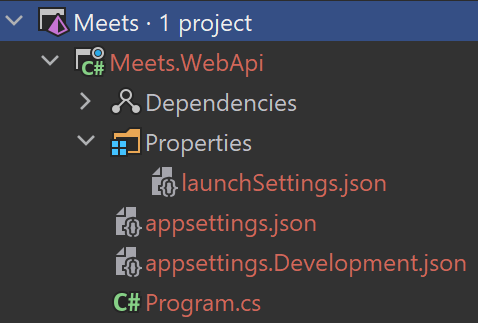
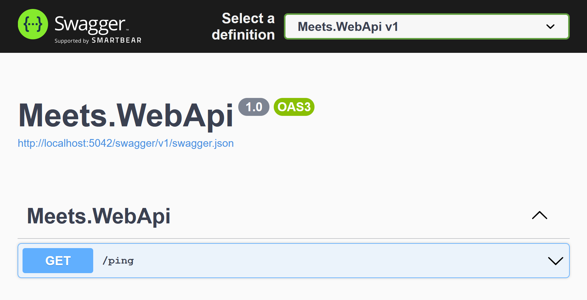

# Создание Minimal API


## Содержание

1. [Создание проекта](Создание-проекта)
2. [Удаление всего лишнего](#Удаление-всего-лишнего)
3. [Добавление ping-point Endpoint'a](#Добавление-ping-point-Endpointa)
4. [Результат](#Результат)

## Создание проекта

Выберите папку, где хотите создать проект (далее root, коренной или папкой
solution'a). Откройте в ней консоль (powershell или терминал в UNIX-системах) и
выполните слудующие команды:
- [Создание Solution](#Создание-Solution)
- [Создание и добавление Web API проекта](#Создание-и-добавление-Web-API-проекта)

После чего откройте Solution в IDE и убедитесь, что ваша структура проекта
соответствует [ожидаемой](#Результат).

### Создание Solution

Создание Solution:
```
dotnet new sln -o . -n Meets
```
| Параметр | Пояснение                        |
| :------- | :------------------------------- |
| new sln  | Создание нового Solution'a       |
| -o .     | Выбрать текущую директорию       |
| -n Meets | Solution должен называться Meets |

### Создание и добавление Web API проекта

Создание Web API проекта:
```
dotnet new webapi -o . -n Meets.WebApi --no-https -minimal
```
| Параметр        | Пояснение                        |
| :-------------- | :------------------------------- |
| new webapi      | Создание нового Web API проекта  |
| -o .            | Выбрать текущую директорию       |
| -n Meets.WebApi | Проект должен называться Meets.WebApi |
| --no-https      | Не использовать [HTTPS](https://www.ssl.com/faqs/what-is-https) |
| -minimal        | Использовать компактный формат [Minimal API](https://docs.microsoft.com/en-us/aspnet/core/fundamentals/minimal-apis) |

Добавление Web API проекта в Solution:
```
dotnet sln . add Meets.WebApi.csproj
```

### Результат




## Удаление всего лишнего

1. [Чистка параметров запуска](#Чистка-параметров-запуска)
2. [Чистка настроек проекта](#Чистка-настроек-проекта)
3. [Чистка основного модуля](#Чистка-основного-модуля)

### Чистка параметров запуска

Файл `launchSettings.json` в папке `Properties` хранит в себе параметры запуска
приложения. Он соответствует следующему формату:
```json
{
  /* Список поддерживаемых настроек */
  "$schema": "https://json.schemastore.org/launchsettings.json",

  /* Настройки IIS (старый сервер приложений) */
  "iisSettings": {
    "windowsAuthentication": false,
    "anonymousAuthentication": true,
    "iisExpress": {
      "applicationUrl": "http://localhost:3823",
      "sslPort": 0
    }
  },

  /* Профили запуска приложения */
  "profiles": {
    
    /* Профиль для запуска в Kestrel (новый сервер приложений) */
    "Meets.WebApi": {
      "commandName": "Project",
      "dotnetRunMessages": true,
      "launchBrowser": true,
      "launchUrl": "swagger",
      "applicationUrl": "http://localhost:5042",
      "environmentVariables": {
        "ASPNETCORE_ENVIRONMENT": "Development"
      }
    },

    /* Профиль для запуска в IIS (старый сервер приложений)  */
    "IIS Express": {
      "commandName": "IISExpress",
      "launchBrowser": true,
      "launchUrl": "swagger",
      "environmentVariables": {
        "ASPNETCORE_ENVIRONMENT": "Development"
      }
    }
  }
}
```
Из этого файла нам нужно удалить всё, что связано со старым сервером приложений
IIS (его настройки и профиль). В результате должна получиться следующая
конфигурация:
```json
{
  "$schema": "https://json.schemastore.org/launchsettings.json",
  "profiles": {
    "Meets.WebApi": {
      "commandName": "Project",
      "dotnetRunMessages": true,
      "launchBrowser": true,
      "launchUrl": "swagger",
      "applicationUrl": "http://localhost:5042",
      "environmentVariables": {
        "ASPNETCORE_ENVIRONMENT": "Development"
      }
    }
  }
}
```

### Чистка настроек проекта

Настройки проекта могут храниться несколькими способами:
- Переменные окружения, прописанные в самой ОС
- Переменные окружения, прописанные в `launchSettings.json`
- [Secrets Manager](https://docs.microsoft.com/en-us/aspnet/core/security/app-secrets)
- `appsettings.json` файлы

Мы уже видели пример указания переменных окружения в `launchSettings.json` (
поле `environmentVariables` в любом профиле). Эта переманная отвечат за то, что
бы приложение было запущено в режиме разработки (в штатном режиме приложение
будет более закрытым в целях обеспечения безопасности, из-за чего нам будет
сложнее с ним работать), так что эту настройку нужно оставить.

А вот файлы `appsettings.json` и `appsettings.Development.json` нужно удалить.
Настройки, описанные там, нам не понадобятся.

### Чистка основного модуля

Файл `Program.cs` - основной модуль проекта: в нём выполняется настройка и
запуск приложения. По стандарту от выглядит следующим образом:
```csharp
var builder = WebApplication.CreateBuilder(args);

// Add services to the container.
// Learn more about configuring Swagger/OpenAPI at https://aka.ms/aspnetcore/swashbuckle
builder.Services.AddEndpointsApiExplorer();
builder.Services.AddSwaggerGen();

var app = builder.Build();

// Configure the HTTP request pipeline.
if (app.Environment.IsDevelopment())
{
    app.UseSwagger();
    app.UseSwaggerUI();
}

var summaries = new[]
{
    "Freezing", "Bracing", "Chilly", "Cool", "Mild", "Warm", "Balmy", "Hot", "Sweltering", "Scorching"
};

app.MapGet("/weatherforecast", () =>
{
    var forecast =  Enumerable.Range(1, 5).Select(index =>
        new WeatherForecast
        (
            DateTime.Now.AddDays(index),
            Random.Shared.Next(-20, 55),
            summaries[Random.Shared.Next(summaries.Length)]
        ))
        .ToArray();
    return forecast;
})
.WithName("GetWeatherForecast");

app.Run();

record WeatherForecast(DateTime Date, int TemperatureC, string? Summary)
{
    public int TemperatureF => 32 + (int)(TemperatureC / 0.5556);
}
```
На нужно удалить из него:
- Все комментарии
- Массив `summaries`
- Endpoint `GET /weatherforecast` (вызов `app.MapGet(...).WithName(...)`)
- Record `WeatherForecast`.
В результате получим:
```csharp
var builder = WebApplication.CreateBuilder(args);

builder.Services.AddEndpointsApiExplorer();
builder.Services.AddSwaggerGen();

var app = builder.Build();

if (app.Environment.IsDevelopment())
{
    app.UseSwagger();
    app.UseSwaggerUI();
}

app.Run();
```

## Добавление ping-point Endpoint'a

На данный момент основной модуль проекта выглядит так:
```csharp
01:  var builder = WebApplication.CreateBuilder(args);
02:  
03:  builder.Services.AddEndpointsApiExplorer();
04:  builder.Services.AddSwaggerGen();
05:  
06:  var app = builder.Build();
07:  
08:  if (app.Environment.IsDevelopment())
09:  {
10:      app.UseSwagger();
11:      app.UseSwaggerUI();
12:  }
13:  
14:  app.Run();
```

Основной модуль можно разделить на 4 логические части:
1. [Настройка builder'a приложения](#Настройка-buildera-приложения)
2. [Настройка приложения](#Настройка-приложения)
3. [Endpoint'ы](#Endpointы)
4. [Запуск-приложения](#Запуск-приложения)

### Настройка builder'a приложения

В 1й строке создаётся builder приложения, в который можно добавить все
необходимые сервисы.
Именно это и делается в строках 3 и 4 (`EndpointsApiExplorer` это сервис,
который проходит по всем объявленным endpoint'ам и собирает информацию о них, а
`SwaggerGen` на основе этой информации генерирует
[`OpenAPI` спецификацию](https://swagger.io/resources/open-api)).
В 6й строке настройка builder'a приложения заканчивается, и мы получаем само
приложение (`app`).

### Настройка приложения

Настройка приложения происходит с 8й по 12ю строки.
Ранее, при рассмотрении [найтрек проекта](#Чистка-настроек-проекта),
упоминалось, что приложение может быть запущено в нескольки хрежимах:
- Production: штатный режим (с ограничениями для обеспечения безопасности)
- Development: режим разработки (без ограничений).
В 8й строке проверяется, какой режим выбран: если выбран режим разработки, то
в 10-11 строках добавляется [Swagger](https://swagger.io/tools/swagger-ui) -
документация по Web API.
Использование Swagger удобно во время разработки, (т.к. там описано всё, что
может делать Web API), но может быть опасно во время штатной работы приложения.

### Endpoint'ы

В этой секции описываются все функции, которое может выполнять Web API и на
данный момент приложение не может делать ничего. Создадми Endpoint:
```csharp
app.MapGet("/ping", () => Results.Ok("pong"));
```
Он описывает, что приложение при запросе `GET: /ping` вернёт результат `200 OK`
с текстом `pong`. Методы запросов (например `GET`) и статус коды ответов (
например `200 OK`) описаны в рамках `HTTP` стандарта и будут более подробно
рассмотрены далее, при изучении `Rest API`.

После добавления `GET /ping` endpoint'a основной модуль выглядит следующим
образом:
```csharp
01:  var builder = WebApplication.CreateBuilder(args);
02:  
03:  builder.Services.AddEndpointsApiExplorer();
04:  builder.Services.AddSwaggerGen();
05:  
06:  var app = builder.Build();
07:  
08:  if (app.Environment.IsDevelopment())
09:  {
10:      app.UseSwagger();
11:      app.UseSwaggerUI();
12:  }
13:  
14:  app.MapGet("/ping", () => Results.Ok("pong"));
15:
16:  app.Run();
```

### Запуск приложения

Команда `app.Run()` запускает приложение.


## Результат

Запустим приложение командой `dotnet run` или с помощью IDE: Должен запуститься
браузер с Swager документацией (если этого не произошло перейдите по url
http://localhost:5042/swagger):



В endpoint'е `GET /ping` выберите `Try it out` и выполните запрос (`Execute`).
Вы должны увидеть, что запрос был обработан успешно:

