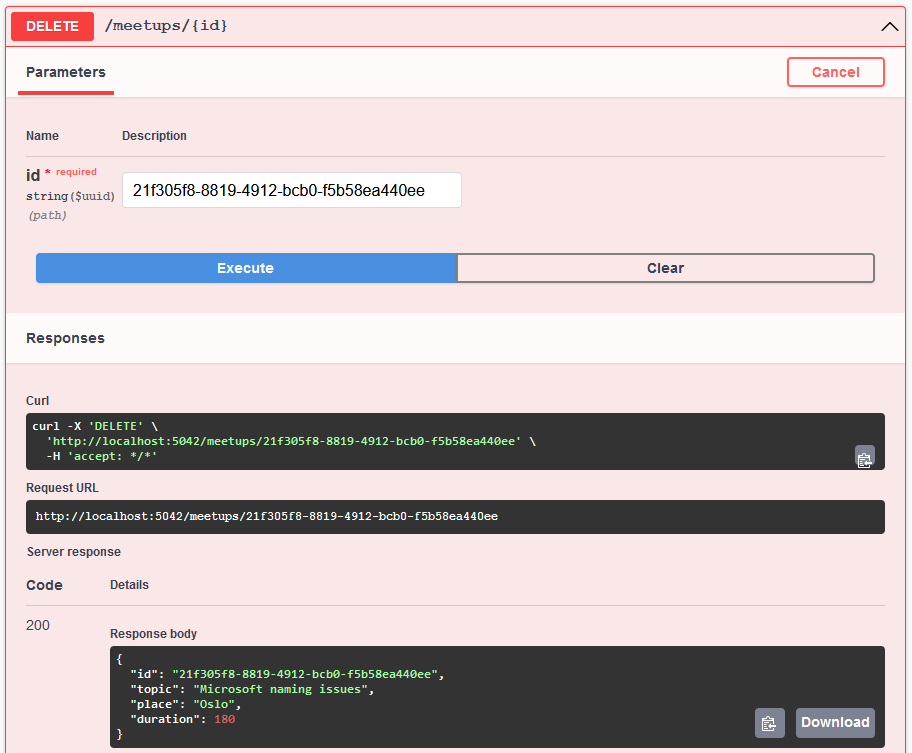
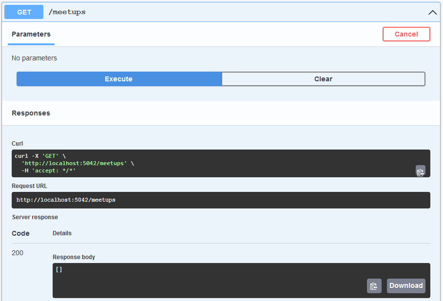

# Meetup Rest CRUD API

В этом уроке мы рассмотрим понятия CRUD и Rest API


## Содержание

1. [Понятие CRUD](#Понятие-CRUD)
2. [Понятие Rest API](#Понятие-Rest-API)
3. [Реализация](#Реализация)
4. [Результат](#Результат)


## Понятие CRUD

Аббревиатура *CRUD* расшифровывается как **C**reate **R**ead **U**pdate **D**elete, т.е. стандартные операции над
данными.


## Понятие Rest API

Rest API – transport-agnostic протокол коммуникации API, зачастую использующий HTTP в качестве транспортного протокола.
Данный протокол хорошо описан в [этой](https://docs.microsoft.com/en-us/azure/architecture/best-practices/api-design)
статье от Microsoft.

В данный момент нам наиболее интересны следующие моменты:
- [CRUD to HTTP mapping](#CRUD-to-HTTP-mapping)
- [HTTP responses](#HTTP-responses)
- [HATEOAS](#HATEOAS)

### CRUD to HTTP mapping

Соотношение CRUD операций и соответствующих им Rest API запросов на примере митапов:
| CRUD operation | Rest API request              |
| :------------- | :---------------------------- |
| Create         | POST /meetups + HTTP Body     |
| Read           | GET /meetups                  |
| Update         | PUT /meetups/{id} + HTTP Body |
| Delete         | DELETE /meetups/{id}          |

### HTTP responses

Расшифровка HTTP status code'ов:
| HTTP response status code | Rest meaning                                                       |
| :------------------------ | :----------------------------------------------------------------- |
| 200 Ok                    | Request processed successfully (with some resource)                |
| 201 Created               | Request processed successfully (with a **newly created** resource) |
| 204 No content            | Request processed successfully (without a resource)                |
| 404 Not found             | Resource was not found                                             |

### HATEOAS

В контексте данного урока, при создании нового митапа, мы просто будем возвращать пользователю url, по которому можно
получить созданный митап.


## Реализация

Мы будем реализовывать CRUD митапов в 5 шагов:
1. [Модель митапа](#Модель-митапа)
2. [Endpoint на получение списка всех митапов](#Endpoint-на-получение-списка-всех-митапов)
3. [Endpoint на удаление митапа по id](#Endpoint-на-удаление-митапа-по-id)
4. [Endpoint на создание митапа](#Endpoint-на-создание-митапа)
5. [Endpoint на апдейт митапа](#Endpoint-на-апдейт-митапа).

### Модель митапа

В конце модуля (обязательно в конце, иначе возникнет ошибка компиляции) нужно создать модель митапа, например:
```csharp
class Meetup
{
    public Guid? Id { get; set; }
    public string Topic { get; set; }
    public string Place { get; set; }
    public int Duration { get; set; }
}
```

| Поле | Комментарий |
| :-- | :-- |
| Guid? Id | Я выбрал `Guid` в качестве типа идентификатора, вы можете использовать что-то другое, например `int`. Идентификатор обязательно должен быть `nullable` (т.е. опциональным), что бы пользователь мог создавать митап без необходимости указывать id |
| string Topic | Тема митапа |
| string Place | Место проведения митапа |
| int Duration | Продолжительность митапа в минутах |

Также, в самом начале секции endpoint'ов в модуле нужно создать список митапов, что бы потом мы могли вести учёт
созданных митапов (добавлять, получать, изменять и удалять их):
```csharp
var meetups = new List<Meetup>();
```

### Endpoint на получение списка всех митапов

Начнём с самого простого endpoint'а – получения всех митапов. Он не сильно отличается от endpoint'а `GET /ping`, 
реализованного в прошлом уроке:
```csharp
app.MapGet("/meetups", () => Results.Ok(meetups));
```

### Endpoint на удаление митапа по id

Далее добавим endpoint на удаление определённого митапа по его id. В соответствии с Rest, метод запроса должен быть
DELETE, а url должен включать id митапа: `DELETE /meetups/{id}`. В результате удаления будем возвращать статус `200 Ok`
и сам удалённый митап, также добавим проверку на наличие митапа, и в случае, если митапа с указанным id не существует,
вернём `404 Not found`:
```csharp
app.MapDelete("/meetups/{id:guid}", ([FromRoute] Guid id) =>
{
    var meetupToDelete = meetups.SingleOrDefault(meetup => meetup.Id == id);

    // meetup with provided id does not exist
    if (meetupToDelete is null)
    {
        return Results.NotFound();
    }

    meetups.Remove(meetupToDelete);
    return Results.Ok(meetupToDelete);
});
```
Запиьс `{id:guid}` в url нужна для того, что бы endpoint принимал в качетсве id только значения в формате `Guid`, т.е.
`xxxxxxxx-xxxx-xxxx-xxxx-xxxxxxxxxxxx`. Атрибут `[FromRoute]` обозначает, что `Guid id` получается из url. Вызов
`SingleOrDefault` проходит по всем митапам и находит тот, который удовлетворяет условию `meetup.Id == id`, а если такого
нет - возвращает `null`.

### Endpoint на создание митапа

Добавим endpoint на создание нового митапа. В соответствии с Rest, endpoint должен быть `POST /meetups` + `HTTP Body`,
в котом будут указаны все необходимые сведения о митапе: тема, место проведения и продолжительность митапа. В результате
создания нового митапа, будем возвращать объект митапа (вместе со сгенерированным id); также вернём url, по которому 
пользователь может получить митап:
```csharp
app.MapPost("/meetups", ([FromBody] Meetup newMeetup) =>
{
    newMeetup.Id = Guid.NewGuid();
    meetups.Add(newMeetup);

    return Results.Created($"/meetups/{newMeetup.Id}", newMeetup);
});
```
Атрибут `[FromBody]` означает, что `Meetup newMeetup` будет получен из тела запроса. Вызов `Guid.NewGuid()` генерирует
уникальный идентификатор. Запись `$"/meetups/{newMeetup.Id}"` - создаёт url, обратившись по которому `GET` методом,
пользователь может получить объект митапа, который он только что создал.

### Endpoint на апдейт митапа

Остался самый сложный запрос - апдейт митапа. По Rest'у, endpoint должен быть `PUT /meetups/{id}` + `HTTP Body` с
обновлённым митапом. В случае успеха, пользователю будет возвращён `204 No content` (т.к. у пользователя уже есть
обновлённая версия митапа), а в случае отсутствия митапа с указанным id - `404 Not found`:
```csharp
app.MapPut("/meetups/{id:guid}", ([FromRoute] Guid id, [FromBody] Meetup updatedMeetup) =>
{
    var oldMeetup = meetups.SingleOrDefault(meetup => meetup.Id == id);

    // meetup with provided id does not exist
    if (oldMeetup is null)
    {
        return Results.NotFound();
    }

    oldMeetup.Topic = updatedMeetup.Topic;
    oldMeetup.Place = updatedMeetup.Place;
    oldMeetup.Duration = updatedMeetup.Duration;

    return Results.NoContent();
});
```


## Результат

В результате файл `Program.cs` теперь выглядит так:
```csharp
01:  using Microsoft.AspNetCore.Mvc;
02:  
03:  var builder = WebApplication.CreateBuilder(args);
04:  
05:  builder.Services.AddEndpointsApiExplorer();
06:  builder.Services.AddSwaggerGen();
07:  
08:  var app = builder.Build();
09:  
10:  if (app.Environment.IsDevelopment())
11:  {
12:      app.UseSwagger();
13:      app.UseSwaggerUI();
14:  }
15:  
16:  var meetups = new List<Meetup>();
17:  
18:  // Crud - Create
19:  app.MapPost("/meetups", ([FromBody] Meetup newMeetup) =>
20:  {
21:      newMeetup.Id = Guid.NewGuid();
22:      meetups.Add(newMeetup);
23:  
24:      return Results.Created($"/meetups/{newMeetup.Id}", newMeetup);
25:  });
26:  
27:  // cRud - read
28:  app.MapGet("/meetups", () => Results.Ok(meetups));
29:  
30:  // crUd - update
31:  app.MapPut("/meetups/{id:guid}", ([FromRoute] Guid id, [FromBody] Meetup updatedMeetup) =>
32:  {
33:      var oldMeetup = meetups.SingleOrDefault(meetup => meetup.Id == id);
34:  
35:      // meetup with provided id does not exist
36:      if (oldMeetup is null)
37:      {
38:          return Results.NotFound();
39:      }
40:  
41:      oldMeetup.Topic = updatedMeetup.Topic;
42:      oldMeetup.Place = updatedMeetup.Place;
43:      oldMeetup.Duration = updatedMeetup.Duration;
44:  
45:      return Results.NoContent();
46:  });
47:  
48:  // cruD - delete
49:  app.MapDelete("/meetups/{id:guid}", ([FromRoute] Guid id) =>
50:  {
51:      var meetupToDelete = meetups.SingleOrDefault(meetup => meetup.Id == id);
52:  
53:      // meetup with provided id does not exist
54:      if (meetupToDelete is null)
55:      {
56:          return Results.NotFound();
57:      }
58:  
59:      meetups.Remove(meetupToDelete);
60:      return Results.Ok(meetupToDelete);
61:  });
62:  
63:  app.Run();
64:  
65:  class Meetup
66:  {
67:      public Guid? Id { get; set; }
68:      public string Topic { get; set; }
69:      public string Place { get; set; }
70:      public int Duration { get; set; }
71:  }
```

Теперь мы можем проверить, как работают новые endpoint'ы:
1. [Добавим митап](#Добавим-митап)
2. [Проверим наличие добавленного митапа](#Проверим-наличие-добавленного-митапа)
3. [Апдейтнем митап](#Апдейтнем-митап)
4. [Проверим наличие изменений в митапе](#Добавим-наличие-изменений-в-митапе)
5. [Удалим митап](#Удалим-митап)
6. [Проверим удалён ли митап](#Проверим-удалён-ли-митап)

### Добавим митап


### Проверим наличие добавленного митапа


### Апдейтнем митап


### Проверим наличие изменений в митапе


### Удалим митап



### Проверим удалён ли митап

