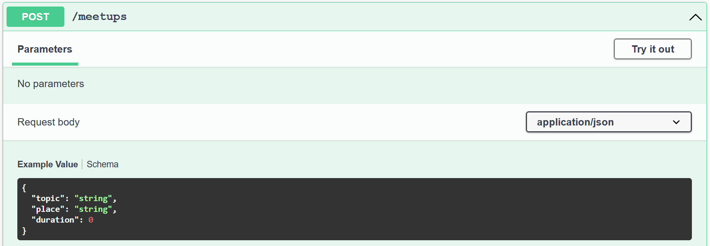

# Data Transfer Objects


## Содержание

1. [Проблемы решаемые использованием DTO](#Проблемы-решаемые-использованием-DTO)
2. [Изменение layout'a и создание DTO](#Изменение-layouta-и-создание-DTO)
3. [Применение DTO в контроллере](#Применение-DTO-в-контроллере)
4. [Результат](#Результат)


## Проблемы решаемые использованием DTO

В предыдущих уроках мы использовали модель `Meetup` для всех операций (запись, чтение, удаление, обновление). Этот
подход может показаться логичным на первый взгляд (т.к. мы каждый раз взаимодействуем с одним и тем же объектом
реального мира), однако этот подход создаёт проблемы. Примером такой проблемы может быть то, что мы не можем
контроллировать формат данных, который мы передаём: например, когда мы возвращаем митапы (`GET /meetups`) мы хотим, что
бы пользователю был доступен id митапа, однако, при создании или апдейте митапа, мы не хотим, что бы пользователь
передавал id в `HTTP Body` (в случае создания митапа мы всё равно перезапишем id сгенерированным вручную, а в случае
апдейта мы получим этот id из url - `PUT /meetups/{id}`). Может быть и наоборот - мы можем захотеть скрыть какое-либо
поле при чтении ресурса: например, персональная информация пользователей. Данная проблема называется overposting.
Разделение модели данных и транспортных объектов помогает решить эту проблему и многие другие (например валидация).


## Изменение layout'a и создание DTO

Перед тем, как мы добавим DTO (**D**ata **T**ransfer **O**bjets), нужно несколько изменить layout:
1. Нужно переименовать папку `Controllers` в `Meetup`
2. Нужно переименовать файл `MeetupController` в просто `Controller` (только файл, название класса оставить как было)
3. Создать файл `Model.cs` в папке `Meetup` и перенести туда класс `Meetup`, заменив модификатор доступа на `internal`
4. Создать файл `DataTransferObjects.cs` в папке `Meetup`.

Теперь можно в файле `DataTransferObjects.cs` создать 3 DTO:
```csharp
public class ReadMeetupDto
{
    public Guid Id { get; set; }
    public string Topic { get; set; }
    public string Place { get; set; }
    public int Duration { get; set; }
}

public class CreateMeetupDto
{
    public string Topic { get; set; }
    public string Place { get; set; }
    public int Duration { get; set; }
}

public class UpdateMeetupDto
{
    public string Topic { get; set; }
    public string Place { get; set; }
    public int Duration { get; set; }
}
```

> **Note**: Кто-то может быть против разделения `CreateMeetupDto` и `UpdateMeetupDto`, т.к. у них одинаковый набор
полей. Это лишь вопрос вкуса, так что можете делать так, как вам будет удобнее; мне лично удобнее так, особенно
учитывая, что это код, который не несёт какой-либо смысловой нагрузки, а значит, его и поддерживать не сложно.


## Применение DTO в контроллере

Теперь нужно перевести контроллер с использования модели `Meetup` на DTO, которые мы только что создали. Начать можно с
создания митапа:
```csharp
[HttpPost]
public IActionResult CreateMeetup([FromBody] CreateMeetupDto createDto)
{
    var newMeetup = new Meetup
    {
        Id = Guid.NewGuid(),
        Topic = createDto.Topic,
        Place = createDto.Place,
        Duration = createDto.Duration
    };
    Meetups.Add(newMeetup);

    var readDto = new ReadMeetupDto
    {
        Id = newMeetup.Id,
        Topic = newMeetup.Topic,
        Place = newMeetup.Place,
        Duration = newMeetup.Duration
    };
    return Ok(readDto);
}
```

Остальные action'ы можете перевести сами по примеру `CreateMeetup`. В результате должно получиться что-то такое:
```csharp
[HttpGet]
public IActionResult GetAllMeetups()
{
    var readDtos = Meetups.Select(meetup => new ReadMeetupDto
    {
        Id = meetup.Id,
        Topic = meetup.Topic,
        Place = meetup.Place,
        Duration = meetup.Duration
    });
    
    return Ok(readDtos);
}

[HttpPut("{id:guid}")]
public IActionResult UpdateMeetup([FromRoute] Guid id, [FromBody] UpdateMeetupDto updateDto)
{
    var oldMeetup = Meetups.SingleOrDefault(meetup => meetup.Id == id);
    if (oldMeetup is null)
    {
        return NotFound();
    }

    oldMeetup.Topic = updateDto.Topic;
    oldMeetup.Place = updateDto.Place;
    oldMeetup.Duration = updateDto.Duration;
    return NoContent();
}

[HttpDelete("{id:guid}")]
public IActionResult DeleteMeetup([FromRoute] Guid id)
{
    var meetupToDelete = Meetups.SingleOrDefault(meetup => meetup.Id == id);
    if (meetupToDelete is null)
    {
        return NotFound();
    }
    Meetups.Remove(meetupToDelete);

    var readDto = new ReadMeetupDto
    {
        Id = meetupToDelete.Id,
        Topic = meetupToDelete.Topic,
        Place = meetupToDelete.Place,
        Duration = meetupToDelete.Duration
    };
    return Ok(readDto);
}
```

> **Note**: Вы, скорее всего, уже заметили, что количество кода увеличилось не только из-за объявления DTO, но и из-за
того, что мы вынуждены копировать значения всех полей из модели в DTO и наоборот. Мы решим эту проблему позже с
использованием [AutoMapper](https://docs.automapper.org/en/latest/Getting-started.html).

## Результат

Теперь пользователь при попытке создать/обновить митап будет сразу видеть, что передавать id митапа в body не нужно:

